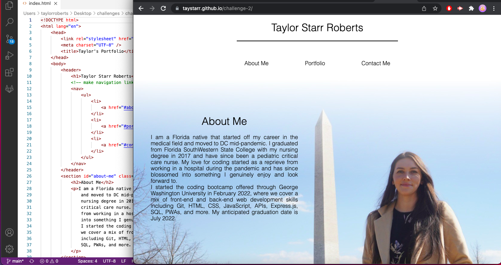

# Taylor's Professional Portfolio

## Motivation

My motivation for creating this page was to be able to have an online portfolio that future employers could access to learn about me and my projects.
This page will also showcase my abilities to code my own website and demonstrate my code neatness.

## Problems

I encountered many problems throughout writing this code including mostly placing text over images and the media query code to make the page mobile friendly.
Many of my problems I was able to resolve using W3 schools and MDN pages as a guide.
I hope in the future to be able to alter this page to include hover features over the portfolio projects to make the page look more professional. 
I will also continue practicing my media query skills and improve the media friendly functions.
I will also contnue editing this page to include the projects I complete with working links to their deployed pages.

## What I Learned

Throughout this project I was able to get the hang of some concepts I had been struggling with by failing repeatedly and working through the failures to eventually find success.

## What Makes this Project Stand Out

This project stands out because it shows an organized and clean looking portfolio that will only improve as time goes on!

### Click [here](https://taystarr.github.io/challenge-2/) to view my project!
